# DevOps Portfolio Project: What We Built, Why, and What We Learned

This guide records the project as it exists now: the implementation flow, the reason for each major choice, the issues encountered, how they were resolved, and what remains before calling the Kubernetes path complete.

## 1. Goal and current status

The goal is to practice a realistic delivery path using free or local tools on Windows 11:

```mermaid
flowchart LR
    Dev[Developer] --> Git[Git and GitHub]
    Git --> CI[GitHub Actions]
    CI --> Test[Compile and test]
    Test --> Image[Build Docker image]
    Image --> Scan[Trivy critical scan]
    Scan --> Registry[GitHub Container Registry]
    Registry -. later, with cluster access .-> K8s[Minikube or Kubernetes]
    K8s --> App[Flask application]
    App --> DB[PostgreSQL]
```



**Implemented and verified:** Flask app, automated tests, Docker image, Docker Compose app and PostgreSQL, GitHub repository, and the GitHub Actions test/build/scan/publish workflow. The latest workflow run passed, including the Trivy scan and GHCR push.

**Present but not yet a complete automated deployment:** Kubernetes YAML and a Helm chart are in the repository. GitHub Actions does not deploy them because a GitHub-hosted runner cannot reach Minikube running on a laptop. Kubernetes PostgreSQL deployment and secure runtime configuration also need more work.

## 2. Project layout

- [`../app.py`](../app.py): Flask routes and the PostgreSQL connectivity probe.
- [`../tests/test_app.py`](../tests/test_app.py): route tests, including database success and failure behavior.
- [`../requirements.txt`](../requirements.txt): pinned Flask, Psycopg, and pytest dependencies.
- [`../Dockerfile`](../Dockerfile): instructions for building the application image.
- [`../docker-compose.yml`](../docker-compose.yml): local app and PostgreSQL services.
- [`../.dockerignore`](../.dockerignore): files excluded from Docker build context.
- [`../.gitignore`](../.gitignore): local/generated files kept out of Git.
- [`../.github/workflows/ci.yml`](../.github/workflows/ci.yml): GitHub Actions checks and GHCR publishing.
- [`../k8s/`](../k8s/): Kubernetes namespace, app deployment, service, ingress, configuration, secret, and autoscaling manifests.
- [`../helm/portfolio-app/`](../helm/portfolio-app/): Helm chart and development/production values.

## 3. Start with the application

We chose Python Flask for a small app whose behavior is easy to understand, leaving the project effort focused on delivery and operations rather than business logic.

The application exposes:

- `/`: a simple page confirming that the app is running.
- `/health`: a lightweight process liveness response. It confirms Flask is responding; it does not prove the database is available.
- `/api/db-check`: opens a PostgreSQL connection and executes `SELECT 1`. It returns HTTP 200 when the database responds and HTTP 503 when it cannot connect.
- `/api/status`: reports the configured environment and database URL. **Do not expose this route publicly as written:** the URL can contain credentials. Before a public deployment, change it to report only safe metadata, never the full connection string.

The distinction between `/health` and `/api/db-check` is intentional. A liveness check should answer “should this process be restarted?” A database check answers “can this app reach its dependency?” Making every liveness probe depend on PostgreSQL could cause Kubernetes to restart healthy app processes during a temporary database outage.

### Database connection

Initially, the app only displayed the `DATABASE_URL`; that did not establish a real connection. We added Psycopg (`psycopg[binary]`) and made `/api/db-check` execute a harmless query. This is a connectivity probe, not a full data model or CRUD feature.

The tests replace the connection call to cover both the connected and unavailable responses without requiring PostgreSQL for every unit-test run. Separately, we exercised the endpoint against the real Compose PostgreSQL container; it returned `{"database":"connected","status":"ok"}`.

## 4. Test behavior before packaging

The pytest suite covers the root page, the health endpoint, and successful and failed database probes. This gives quick feedback before building or publishing an image.

In the container, use:

```powershell
docker compose exec app python -m pytest -q
```

The `python -m pytest` form reliably includes the current project directory on Python's import path. In this environment, invoking the `pytest` executable directly inside the container failed to import `app`, while `python -m pytest` passed all four tests.

## 5. Package the app with Docker

The [`../Dockerfile`](../Dockerfile) starts from `python:3.12-slim`, sets `/app` as the working directory, installs dependencies, copies the source, exposes port 5000, and runs `python app.py`.

Important Docker concepts learned:

- An **image** is the built template; a **container** is a running instance of that image.
- `EXPOSE 5000` documents the app's container port. Compose's `5000:5000` mapping makes it reachable at `localhost:5000` on Windows.
- Because the Dockerfile copies source into the image, editing `app.py` does not update an existing container automatically. Rebuild and recreate the service after code changes:

```powershell
docker compose up -d --build app
```

This is a deliberately simple single-stage image. A later hardening pass can separate build and runtime dependencies, run as a non-root user, and use a production WSGI server instead of Flask's development server.

## 6. Run the app and PostgreSQL with Compose

Compose makes the local multi-container setup repeatable. The app connects to host `db`, not `localhost`, because Compose gives services DNS names on a private project network. The PostgreSQL data directory is backed by the named `postgres_data` volume, so ordinary container recreation does not discard the database files.

The app declares `depends_on: condition: service_healthy`. PostgreSQL has a `pg_isready` healthcheck, so Compose waits for the database to accept connections before starting the app. A simple `depends_on: - db` would only order container startup; it would not guarantee that PostgreSQL had finished initialization.

Start and inspect the stack:

```powershell
cd C:\dev-po1
docker compose up -d --build
docker compose ps
docker compose exec db pg_isready -U postgres -d appdb
```

Expected checks in the browser or PowerShell:

```powershell
Invoke-RestMethod http://localhost:5000/health
Invoke-RestMethod http://localhost:5000/api/db-check
```

Stop the stack without deleting its database volume:

```powershell
docker compose down
```

`docker compose down -v` also deletes named volumes and therefore removes this local database data. Use it only when that data can be discarded.

This PostgreSQL setup is for learning and local development, not production-grade storage. The Compose file contains demo credentials, the database is exposed on host port 5432 for local access, and the named volume is not a backup or high-availability strategy. Do not reuse these credentials in a real deployment.

## 7. Source control and GitHub

Git tracks the project history; GitHub stores the shared repository and provides the hosted Actions runners. The project is pushed to `https://github.com/yashvardhan06/flask-devops` on branch `main`.

The `.gitignore` excludes generated Python files and local environment files so caches and personal configuration do not become source artifacts. The Docker ignore file has a separate purpose: it reduces and sanitizes the files sent to Docker during image builds.

The PostgreSQL connection and Actions work were recorded in focused commits. Keeping changes focused makes it easier to connect a CI run to the commit that triggered it.

## 8. Automate checks and image publishing with GitHub Actions

The workflow in [`../.github/workflows/ci.yml`](../.github/workflows/ci.yml) runs on pushes and pull requests targeting `main`. In order, it:

1. Checks out the repository and sets up Python 3.12.
2. Installs the pinned requirements.
3. Runs `compileall`, pytest, and a Python compile check.
4. Builds the Docker image tagged with the commit SHA.
5. Scans that image with Trivy. The gate fails on critical vulnerabilities for which a fix is available; unfixable findings do not block this learning pipeline.
6. On a push to `main` only, logs in to GHCR with the automatically provided `GITHUB_TOKEN` and pushes the SHA-tagged image.

Pull requests run the checks and scan but do not publish an image. This avoids trying to use package-write permissions from untrusted fork pull requests. The workflow declares `contents: read` and `packages: write` so the runner has the access needed for checkout and publishing.

The successful workflow run is [CI run #5](https://github.com/yashvardhan06/flask-devops/actions/runs/36439132957). It verified the tests, image build, Trivy scan, registry login, and image push. GitHub Actions runs can be inspected under the repository's **Actions** tab; open a run and select `build-test` to see its steps.

### Why Kubernetes deployment is not in this workflow yet

The earlier workflow tried to deploy automatically using a `KUBE_CONFIG` secret. A standard GitHub-hosted runner is an ephemeral machine on GitHub's network; it cannot reach a Minikube API server running privately on this Windows laptop. A kubeconfig secret alone does not make a private local cluster reachable. The unconditional deploy job was removed so ordinary pushes can complete reliable CI instead of failing at an unreachable deployment step.

To automate deployment later, use a self-hosted GitHub Actions runner that can access the local cluster, or use a remotely accessible cluster. Then add a protected deployment job, environment approvals for production, and credentials stored as GitHub secrets. Never put kubeconfig contents or real database passwords in the repository.

## 9. Kubernetes and Helm groundwork

The `k8s/` directory contains development and production namespaces, app Deployments, Services, ingress, ConfigMap/Secret, and HPA resources. Deployment specs define labels and selectors, health probes, resource requests, and limits. The Helm chart packages similar configurable resources and has separate development and production values, including different replica counts and resource settings.

These files are groundwork, not proof that the whole Kubernetes application is currently deployable. The checked-in Kubernetes manifests use a placeholder GHCR image, and there is no PostgreSQL Deployment/StatefulSet or Service in `k8s/`; the Helm values refer to a `postgres` host that must exist. Before a real Kubernetes deployment, set the image to the pushed GHCR tag, provide PostgreSQL (or an explicitly chosen database service), fix credentials through Kubernetes Secrets, and validate the chart and manifests against the actual Minikube cluster.

Compose and Kubernetes solve related but different problems. Compose is convenient for a laptop-sized development stack. Kubernetes schedules and manages workloads in a cluster using Pods, Deployments, Services, probes, and related controllers. A Compose named volume does not become a production Kubernetes storage plan automatically.

## 10. Problems we faced and how we resolved them

| What happened | Why it happened | Resolution and lesson |
| --- | --- | --- |
| Docker could not start containers at first. | Docker Desktop's daemon was not running. | Started Docker Desktop, then retried the build and run commands. The CLI being installed does not mean the daemon is ready. |
| `docker run --name portfolio-app` reported a name conflict. | A previous container already had that global name. | Checked `docker ps`, stopped the standalone container, and removed fixed `container_name` entries from Compose so Compose could generate project-scoped names. Container names and host ports can both conflict. |
| Compose warned that `version` was obsolete. | Modern Compose ignores the old top-level version key. | Removed it; current Compose reads the service model directly. |
| Compose services started but database readiness was uncertain. | Startup ordering alone does not wait for PostgreSQL initialization. | Added the `pg_isready` healthcheck and made the app depend on `service_healthy`. |
| `/health` returned OK even before there was a database connection check. | It only measured Flask process responsiveness. | Added `/api/db-check` with a real `SELECT 1`, kept `/health` lightweight, and verified both separately. |
| PowerShell `curl` displayed a script-execution warning and parsed HTML-like output. | In Windows PowerShell, `curl` can be an alias for `Invoke-WebRequest`, not curl itself. | Used `Invoke-RestMethod` for JSON or `curl.exe` to call the actual curl binary. |
| Minikube/Helm/kubectl commands were not found in some VS Code terminals. | Their installation directories were not on that terminal's `PATH`. | Located the executable and invoked it by its full path. A future setup step is to add the tool directories to `PATH` and reopen the terminal. |
| A Git push initially faced repository-history/remote issues. | The local history and remote repository were not aligned, and the first remote choice was unsuitable for a clean initial push. | Switched to the intended empty GitHub repository, set `origin` to the correct URL, and pushed to `main`. |
| `pytest -q` inside the app container could not import `app`. | The pytest console-script invocation did not include the project root on `sys.path` in that container context. | Used `python -m pytest -q`; all four tests passed. Prefer this invocation in the workflow and container. |
| The first GitHub Actions run failed at Trivy after tests and Docker build passed. | The initial gate treated both HIGH and CRITICAL image findings as blocking. | Changed the gate to block on fixable CRITICAL findings, updated checkout/setup-python to Node 24-compatible major versions, and verified the next full run succeeded. |
| Automatic Helm deployment was unsuitable for the current local cluster. | GitHub-hosted runners cannot reach private Minikube on the laptop; the old job also assumed a kubeconfig secret. | Removed automatic deployment from push CI. Keep cluster deployment manual until a self-hosted runner or reachable cluster is deliberately configured. |
| Code edits did not appear in the already-running app container. | The Docker image contains a copy of the source made at build time; Compose has no source bind mount. | Rebuild the app service with `docker compose up -d --build app`, then refresh the page. |

## 11. What we learned

- A successful image build, a running container, a healthy application, and a working database connection are separate states; each needs its own check.
- Docker images are immutable build outputs. Container names and published ports are host-level resources that must not collide.
- Compose service names provide internal DNS. Containers should connect to `db:5432`, while the browser connects to the published host port `localhost:5000`.
- A healthcheck makes readiness observable. `depends_on` can wait for that health state; simple startup order cannot.
- Unit tests should be quick and isolated; a live Compose request verifies integration with the real database.
- A GitHub Actions workflow is executable infrastructure. It should be tested by pushing and reading the actual run, not only by looking at YAML.
- Registry publishing needs explicit token permissions and should be gated to trusted branch pushes. A commit-SHA tag identifies exactly which source produced an image.
- Vulnerability policy is a release decision. This workflow blocks fixable critical findings; the threshold should be revisited as the image and risk requirements evolve.
- Hosted CI and a laptop cluster are separate network locations. Secrets carry credentials, not network reachability.
- Kubernetes YAML and Helm templates are not equivalent to a verified cluster release. Validate prerequisites, secrets, image pulls, database availability, rollout, and an application smoke test.

## 12. Useful commands at a glance

Run the local stack and confirm it is ready:

```powershell
docker compose up -d --build
docker compose ps
docker compose exec db pg_isready -U postgres -d appdb
docker compose exec app python -m pytest -q
Invoke-RestMethod http://localhost:5000/health
Invoke-RestMethod http://localhost:5000/api/db-check
```

Rebuild after editing `app.py`:

```powershell
docker compose up -d --build app
```

See application logs and stop the stack:

```powershell
docker compose logs -f app
docker compose down
```

For the hosted pipeline, push a commit to `main`, then open the repository's **Actions** tab. The workflow will test, build, scan, and publish the image when all required checks pass.